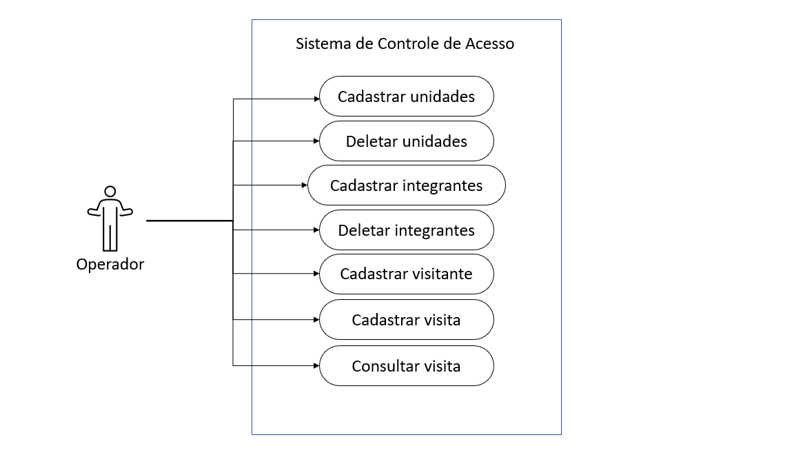

<h1 align="center">Ciclo de Vida de um Software</h1>
"We see three critical differences between programming and software engineering: time, scale, and the trade-offs at play. On a software engineering project, engineers need to be more concerned with the passage of time and the eventual need for change. In a software engineering organization, we need to be more concerned about scale and efficiency, both for the software we produce as well as for the organization that is producing it. Finally, as software engineers, we are asked to make more complex decisions with higher-stakes outcomes, often based on imprecise estimates of time and growth. Within Google, we sometimes say, “Software engineering is programming integrated over time.” Programming is certainly a significant part of software engineering: after all, programming is how you generate new software in the first place. If you accept this distinction, it also becomes clear that we might need to delineate between programming tasks (development) and software engineering tasks (development, modification, maintenance). The addition of time adds an important new dimension to programming. Cubes aren’t squares, distance isn’t velocity. Software engineering isn’t programming."

Titus Winters, Software Engineering at Google

Ciclo de vida do software é um termo usado para definir a sequência de etapas desde a concepção do sistema até a desativação do sistema pelo desenvolvedor. Ele ajuda a orientar as equipes de desenvolvimento e alocar recursos de maneira direcionada.

Exemplo: Controle de Pessoas e Residencias de uma Cidade

<h2>Requisitos Funcionais</h2>
<ul>
  <li>Funcionário pode cadastrar um novo visitante, consultar e excluir.</li>
  <li>Funcionário pode criar unidades respectivas a cada casa do condomínio.</li>
  <li>Funcionário pode cadastrar moradores em suas unidades.</li>
  <li>Funcionário pode dar baixa em visitante.</li>
</ul>

<h2>Requisitos Não Funcionais</h2>
<ul>
  <li>Eficiencia: Bom tempo de resposta do sistema.</li>
  <li>Usabilidade: Interface simples para facilidade na operabilidade.</li>
  <li>Confiabiliade: Sistema toletante a erros.</li>
</ul>
    
<h2>Diagrama de Caso de Uso</h2>

<h2>Diagrama de Classe</h2>

